### 👋 Karim —❖— @devkarim

Hi, I’m Karim. I started programming in 2016 and explored different areas like desktop, mobile, and web development. These days, I focus mainly on backend development with some interest in AI. I enjoy building unique projects as well as recreating popular ones with my personal touch to learn how big companies operate. I’ve also been freelancing for two years on platforms like Upwork, Freelancer.com, and LinkedIn, and collaborated with startups to build websites from the ground up—a passion I truly enjoy. My goal is to travel abroad and discover new opportunities.

I’ve contributed to organizations like [@mozakrtna](https://github.com/Mozakrtna) and [@elyra](https://github.com/ElyraTeam) and I’ve been an active member of the [CIT](http://cit.gg) community for a long time. One of my achievements was being recognized by Egypt’s Minister of Communications for completing a [course](https://graduation.udacity.com/confirm/MERE275A) (link does not work due to Udacity updates) where I ranked in the top three and even appeared on TV.

Feel free to reach out if you're interested in collaborating on open-source projects.

## Me

### Currently Learning
- Backend Engineering.
- Advanced Java.
- Java Spring.
- Databases Internals.
- Advanced Algorithms.

### Projects I've worked on
- [Discord Clone](https://discord-clone.karimwael.com) ([repo](https://github.com/devkarim/discord-clone))
- [Spotify Clone](https://spotify-clone.karimwael.com) ([repo](https://github.com/devkarim/spotify-clone))
- [Admin Store](https://admin.ecommerce-fake.karimwael.com) ([repo](https://github.com/devkarim/ecommerce-fake-admin))
- [Store](https://ecommerce-fake.karimwael.com) ([repo](https://github.com/devkarim/ecommerce-fake))
- [Elyra Games](https://elyragames.netlify.app) ([repo](https://github.com/ElyraTeam/MinigamesWeb))
- [Polls](https://polls.karimwael.com) ([repo](https://github.com/devkarim/polls))

## What I do

### Languages I can work with  

  
  
  
  
  
  
  
  
  
  
  

  

### Frameworks, Libraries and Tools  

  
  
  
  
  
  
  
  
  
  
  
  
  
  
  
  
  
  
  
  

  

### Other things I experienced with  

  
  
  
  
  
  
  

  

### What I want to try and learn  

  
  
  
  
  
  
  
  
  
  
  
  

  

## Github Stats  

  

  

